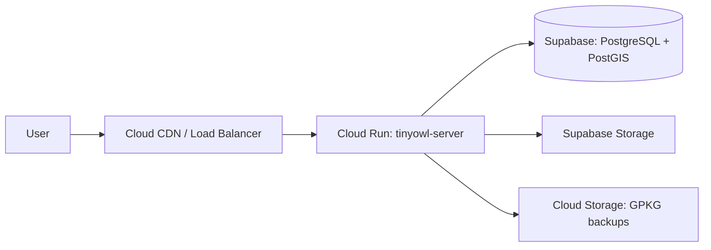

# Google Cloud Run Deployment

This guide covers deploying the TinyOwl server on Google Cloud Run for serverless, auto-scaling operation. The database remains in Supabase.

## Architecture



## Prerequisites

- [Google Cloud SDK](https://cloud.google.com/sdk/docs/install) installed and configured
- A Google Cloud project with billing enabled
- Cloud Run and Artifact Registry APIs enabled
- A Supabase project (hosts the database and handles authentication)
- A Cloud Storage bucket for persistent GPKG storage (Cloud Run instances are ephemeral)

## Step 1: Build and Push the Image

```bash
cd tinyowl-server

# Build the Docker image
docker build -t europe-west2-docker.pkg.dev/<project-id>/tinyowl/server:latest .

# Push to Artifact Registry
docker push europe-west2-docker.pkg.dev/<project-id>/tinyowl/server:latest
```

## Step 2: Create a Cloud Storage Bucket

Since Cloud Run instances have ephemeral disks, store canonical GPKGs and diffs in Cloud Storage:

```bash
gsutil mb gs://<project-id>-tinyowl-data
```

## Step 3: Deploy to Cloud Run

```bash
gcloud run deploy tinyowl-server \
  --image=europe-west2-docker.pkg.dev/<project-id>/tinyowl/server:latest \
  --region=europe-west2 \
  --platform=managed \
  --allow-unauthenticated \
  --memory=512Mi \
  --cpu=1 \
  --min-instances=0 \
  --max-instances=10 \
  --concurrency=80 \
  --set-env-vars="\
DATABASE_URL=postgres://postgres:<password>@db.<project>.supabase.co:5432/postgres,\
STORAGE_BASE_URL=https://<project>.supabase.co,\
STORAGE_SERVICE_ROLE_KEY=<service-role-key>,\
STORAGE_BUCKET=tinyowl-projects,\
LISTEN_ADDR=:8080,\
LOG_LEVEL=info,\
STORE_ROOT=/tmp/tinyowl-data\
"
```

## Step 4: Deploy the Frontend (Optional)

```bash
cd tinyowl-frontend
docker build -t europe-west2-docker.pkg.dev/<project-id>/tinyowl/frontend:latest .
docker push europe-west2-docker.pkg.dev/<project-id>/tinyowl/frontend:latest

gcloud run deploy tinyowl-frontend \
  --image=europe-west2-docker.pkg.dev/<project-id>/tinyowl/frontend:latest \
  --region=europe-west2 \
  --platform=managed \
  --allow-unauthenticated \
  --memory=256Mi \
  --cpu=1 \
  --set-env-vars="\
PUBLIC_API_URL=https://tinyowl-server-xxxxx-ew2.a.run.app,\
PUBLIC_SUPABASE_URL=https://<project>.supabase.co,\
PUBLIC_SUPABASE_ANON_KEY=<anon-key>\
"
```

## Scaling Configuration

| Setting | Recommended | Description |
|---|---|---|
| `min-instances` | `0` | Scale to zero when idle (cost-saving) |
| `max-instances` | `10` | Upper bound for auto-scaling |
| `concurrency` | `80` | Requests per instance |
| `memory` | `512Mi` | Per-instance memory |
| `cpu` | `1` | Per-instance CPU |

Adjust based on your workload. For high-traffic deployments, set `min-instances=1` to avoid cold starts.

## Custom Domain

Map a custom domain to your Cloud Run service:

```bash
gcloud beta run domain-mappings create \
  --service=tinyowl-server \
  --domain=api.tinyowl.example.com \
  --region=europe-west2
```

Cloud Run automatically provisions a managed TLS certificate.

## Monitoring and Logging

```bash
# View logs
gcloud run services logs tail tinyowl-server --region=europe-west2

# View metrics in Cloud Console
# https://console.cloud.google.com/run

# Set up uptime checks
gcloud monitoring uptime-checks create http tinyowl-server-health \
  --resource-type=cloud-run-service \
  --resource-labels=service_name=tinyowl-server \
  --path=/health \
  --period=60s
```

## Cost Estimate

| Resource | Monthly (low usage) | Monthly (moderate) |
|---|---|---|
| Cloud Run (server) | ~$0 (scale to zero) | ~$15 |
| Cloud Run (frontend) | ~$0 | ~$5 |
| Cloud Storage | ~$1 | ~$5 |
| Supabase (free tier) | $0 | $0 |
| Supabase (pro) | $25 | $25 |
| **Total** | **~$1/month** | **~$50/month** |

## Backups

Backups are handled at two levels:

- **Supabase** — PostgreSQL backups via Supabase dashboard: Project Settings > Database > Backups
- **Cloud Storage** — Canonical GPKGs and diffs can be backed up with Object Versioning enabled on the bucket

```bash
# Enable versioning on the bucket
gsutil versioning set on gs://<project-id>-tinyowl-data

# Manual backup
pg_dump "$DATABASE_URL" > backup.sql
```

## Environment Variables Reference

| Variable | Required | Description |
|---|---|---|
| `DATABASE_URL` | Yes | Supabase PostgreSQL connection string |
| `STORAGE_BASE_URL` | No | Supabase Storage base URL for backups and media |
| `STORAGE_SERVICE_ROLE_KEY` | No | Supabase service role key for storage access |
| `STORAGE_BUCKET` | No | Supabase Storage bucket name |
| `LISTEN_ADDR` | No | Must be `:8080` for Cloud Run (default) |
| `CORS_ORIGIN` | No | Allowed CORS origin |
| `LOG_LEVEL` | No | `debug`, `info`, `warn`, `error` |
| `STORE_ROOT` | No | Local path for GPKG storage (default: `data/`) |

> **Note on ephemeral storage:** Cloud Run instances have an in-memory filesystem. The `STORE_ROOT` on Cloud Run should be considered ephemeral — rely on Supabase Storage for persistence. For production Cloud Run deployments, canonical files are fetched from storage on cold start.

## Next Steps

- [Docker Deployment](/docs/deployment/docker/) — Self-hosted Docker deployment
- [API Reference](/docs/api/) — Configure clients to use your deployed API
- [TOML Config Reference](/docs/config/tinyowl-toml/) — Project and table configuration
