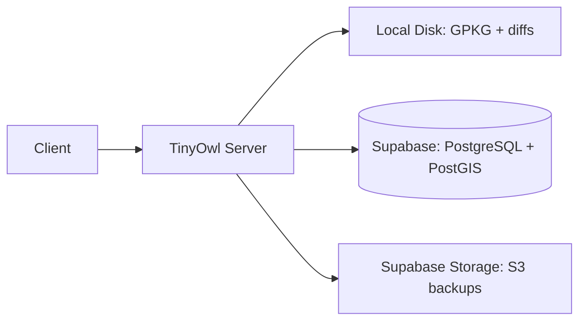

# Docker Deployment

This guide covers deploying TinyOwl in production using Docker. The server is a single stateless service backed by Supabase for the database and storage.

## Prerequisites

- Docker 24+ and Docker Compose v2
- A [Supabase](https://supabase.com/) project (hosts PostgreSQL + PostGIS and storage)
- A domain name (optional, for TLS)

## Architecture

TinyOwl Server is stateless. It stores canonical GeoPackage files on local disk with optional S3/Supabase Storage backup. Metadata (projects, column mappings, spatial index, media index) lives in Supabase Postgres.



## Docker Compose Setup

Create a `docker-compose.yml`:

```yaml
version: "3.8"

services:
  server:
    image: ghcr.io/tinyowl/tinyowl-server:latest
    restart: unless-stopped
    ports:
      - "8090:8090"
    environment:
      DATABASE_URL: ${DATABASE_URL}
      STORAGE_BASE_URL: ${STORAGE_BASE_URL}
      STORAGE_SERVICE_ROLE_KEY: ${STORAGE_SERVICE_ROLE_KEY}
      STORAGE_BUCKET: ${STORAGE_BUCKET}
      LISTEN_ADDR: ":8090"
      CORS_ORIGIN: ${CORS_ORIGIN:-*}
      LOG_LEVEL: ${LOG_LEVEL:-info}
      STORE_ROOT: /data
    volumes:
      - tinyowl_data:/data

  frontend:
    image: ghcr.io/tinyowl/tinyowl-frontend:latest
    restart: unless-stopped
    ports:
      - "5173:3000"
    environment:
      PUBLIC_API_URL: ${PUBLIC_API_URL:-http://localhost:8090}
      PUBLIC_SUPABASE_URL: ${SUPABASE_URL}
      PUBLIC_SUPABASE_ANON_KEY: ${SUPABASE_ANON_KEY}
    depends_on:
      - server

volumes:
  tinyowl_data:
```

## Environment Variables

Create a `.env` file:

```bash
# Supabase database
DATABASE_URL="postgres://postgres:<password>@db.<project>.supabase.co:5432/postgres"

# Supabase storage (for backups and media)
STORAGE_BASE_URL=https://<project>.supabase.co
STORAGE_SERVICE_ROLE_KEY=<your-service-role-key>
STORAGE_BUCKET=tinyowl-projects

# Supabase auth (used by frontend)
SUPABASE_URL=https://<project>.supabase.co
SUPABASE_ANON_KEY=<your-anon-key>

# Server
LISTEN_ADDR=:8090
CORS_ORIGIN=https://your-domain.com
LOG_LEVEL=info
STORE_ROOT=/data

# Frontend
PUBLIC_API_URL=https://api.your-domain.com
```

## Starting the Stack

```bash
# Start all services
docker compose up -d

# Check status
docker compose ps

# View logs
docker compose logs -f server
```

## TLS with Reverse Proxy

For production, use a reverse proxy like Caddy, Nginx, or Traefik:

```text
api.tinyowl.example.com {
    reverse_proxy localhost:8090
}

app.tinyowl.example.com {
    reverse_proxy localhost:5173
}
```

## Health Checks

```bash
# Server health
curl http://localhost:8090/health
# {"status": "ok"}
```

## Backups

Canonical GeoPackage files and diffs are stored in the `STORE_ROOT` directory (mounted as a Docker volume). Back them up with your normal volume backup strategy.

```bash
# Backup the data volume
docker run --rm -v tinyowl_data:/data -v $(pwd):/backup alpine \
  tar czf /backup/tinyowl-data-$(date +%Y%m%d).tar.gz -C /data .
```

Supabase manages its own backups for the PostgreSQL database.

## Resource Requirements

| Service | CPU | RAM | Disk |
|---|---|---|---|
| TinyOwl Server | 1 core | 512 MB | Depends on GPKG sizes |
| TinyOwl Frontend | 0.5 core | 256 MB | 500 MB |
| Supabase (managed) | — | — | — |

The `STORE_ROOT` disk should be sized to accommodate your project GeoPackages and diff history. Each project's canonical GPKG grows with entity data; diffs are typically small (incremental changes).

## Updating

```bash
# Pull latest images
docker compose pull

# Restart with new images
docker compose up -d
```

## Next Steps

- [Cloud Run Deployment](/docs/deployment/cloud-run/) — Serverless deployment on Google Cloud
- [API Reference](/docs/api/) — Configure clients to use your deployed API
- [TOML Config Reference](/docs/config/tinyowl-toml/) — Project and table configuration
