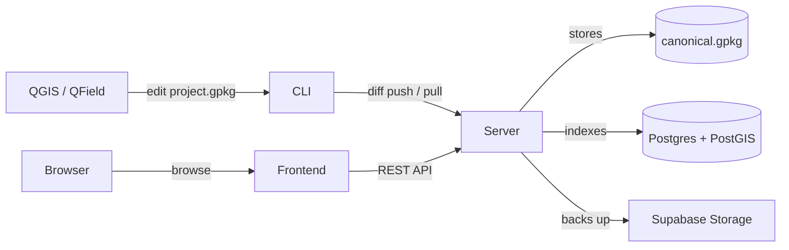

# TinyOwl Documentation

TinyOwl is an open-source platform for collaborative archaeological field data. It combines versioned GeoPackage storage, a diff-based sync CLI, a REST API, and a rich web UI — so teams can work offline in QGIS or QField, push changes when connected, and browse harmonised results in the browser.

## Who is TinyOwl for?

- **Field archaeologists** — record trenches, contexts, finds, and samples in QGIS/QField and sync back to base.
- **Project directors** — review data, manage team access, and publish results through a web dashboard.
- **Data managers** — harmonise local terminologies against standard vocabularies (PeriodO, AAT, CIDOC CRM).
- **Developers** — extend the platform or build integrations via the REST API and CLI.

## Architecture

TinyOwl has three components in separate repositories, each with a clear job:

| Component | Language | Role |
|---|---|---|
| `tinyowl-cli` | Go | Command-line tool. Creates projects, imports data, computes diffs, pushes/pulls to the server. |
| `tinyowl-server` | Go | REST API server. Stores canonical GeoPackages, applies diffs, indexes metadata in Postgres/PostGIS, runs spatial + semantic search. |
| `tinyowl` frontend | SvelteKit | Web UI. Browse projects, explore layers on 2D/3D maps, manage media and artefacts, configure settings, search across projects. |

### How it fits together

Authentication: Supabase Auth for web UI users, device-code OAuth for CLI users. Entity data lives in GeoPackages — Postgres stores metadata, spatial indices, and vector embeddings for search.

## Key features

### Data & sync
- **Diff-based push/pull** — Only changes travel over the wire. First push seeds the schema; subsequent pushes are incremental binary diffs. A Merkle-chain ledger ensures integrity.
- **Dual-GPKG model** — `canonical.gpkg` is the append-only source of truth. `project.gpkg` is an editable working copy exported from canonical after every sync.
- **Import anything** — CSV, GeoJSON, Shapefile, or legacy GeoPackages. Auto-generates TOML table schemas with CRM vocabulary suggestions.

### Tables & schemas
- **TOML-defined tables** — Declare columns with types (`string`, `integer`, `arch_date`, `enum`, `array`, `media`, `geometry`), vocabulary bindings, CRM property/range annotations, and cross-table references.
- **Schema graph** — Interactive entity-relationship visualisation showing FK edges, QGIS relations, and inferred links between tables.

### Media & artefacts
- **Content-addressed storage** — Files keyed by SHA-256 hash. Upload once, reference anywhere. Supports images, video, audio, PDFs, and 3D tilesets (`.3tz`).
- **CARE metadata** — Per-media consent flags for public view and embed permissions.
- **Artefact gallery** — Infinite-scroll media browser with type filters, full viewer, similar-media search, and entity linking.

### Maps & visualisation
- **2D Leaflet maps** — Multiple toggleable layers with per-entity popups, palette colouring, and URL-driven entity highlighting.
- **3D CesiumJS scenes** — Load `.3tz` tilesets and GeoJSON entities on a globe. Toggle layers and models, select entities with overlay popups.
- **Bounding-box overview** — Every project shows its spatial extent on a mini-map.

### Search & discovery
- **Full-text + semantic search** — Combines Postgres FTS with OpenCLIP image/text embeddings. Filter by spatial extent, temporal range, tags, or vocabularies.
- **Project centroids map** — Homepage shows all visible projects on a world map.
- **Similar projects** — Find related work by tag, temporal, and spatial overlap.
- **OpenAlex integration** — Discover linked scholarly articles for each project.

### Collaboration & access
- **Four-tier roles** — Owner, Admin, Collaborator, Viewer. Per-project membership managed via web UI or API.
- **QFieldCloud bridge** — Link projects to QFieldCloud accounts for field data collection sync.
- **CLI device-code OAuth** — `tinyowl login` opens a browser, verifies, and stores a long-lived PAT. No password-sharing needed.
- **API tokens** — Create and revoke `tol_` tokens via the Settings page.

### Data quality
- **Validation** — Schema checks against TOML definitions on every push. Advisory warnings for unmapped vocabularies, missing required fields, range violations.
- **Column mappings** — Map local values to external vocabularies (PeriodO, AAT, CIDOC CRM). Bulk-apply similar values, track mapping progress.
- **CRM annotations** — Per-column `property` and `range` bindings with TOML ownership (auto-applied on push, manual overrides preserved).

### Customisation
- **Theme engine** — Choose accent hue, background base (pitch/dark/dim/stone/paper), border radius, and glass blur from the Appearance settings. Persisted to Supabase user metadata.

## Quick links

- [Getting Started](getting-started.md) — Install and run TinyOwl end-to-end
- [Core Concepts](concepts.md) — Projects, tables, push/pull, media, mappings, roles
- [CLI Reference](cli/) — Every CLI command and flag
- [API Reference](/api/) — Complete REST API documentation
